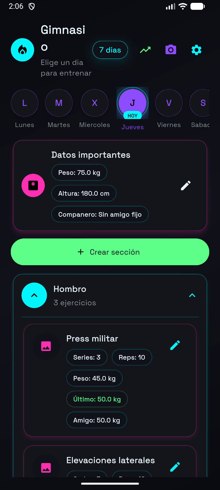
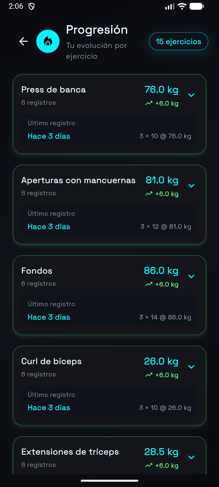
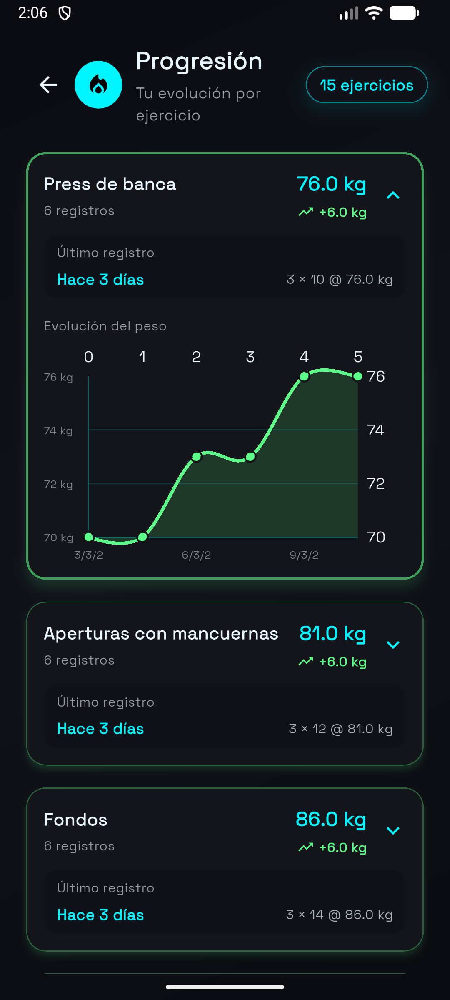
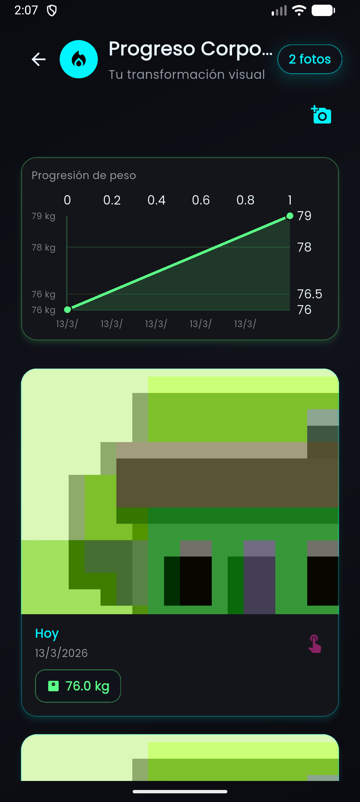

# GymTracker

Aplicación de seguimiento de entrenamientos desarrollada con Flutter para registrar cargas, evolución semanal y progreso personal de forma simple y rápida.

[](https://paimilla.github.io/app-gimnacio/)
[](https://flutter.dev)
[](https://dart.dev)

## Demo

- Demo web en vivo: https://paimilla.github.io/app-gimnacio/
- Si no carga al primer intento, recarga con Ctrl+F5.

## ¿Qué puedes hacer en la app?

- Planificar entrenamientos por día y grupo muscular.
- Registrar peso, repeticiones y notas por ejercicio.
- Comparar progreso con amigos.
- Visualizar evolución con gráficos.
- Guardar fotos de transformación corporal.
- Mantener datos locales sin depender de backend.

## Stack técnico

- Flutter
- Dart
- SharedPreferences
- FL Chart
- Image Picker
- Google Fonts
- URL Launcher

## Capturas

<p align="center">
  
  
  
  
</p>

## Inicio rápido local

Requisitos:

- Flutter 3.x
- Dart SDK 3.x

Ejecutar el proyecto:

```bash
flutter pub get
flutter run
```

Build web local:

```bash
flutter run -d chrome
```

## Estructura actual

```text
flutter_application_1/
├── lib/
│   └── main.dart
├── assets/
├── android/
├── ios/
├── web/
└── pubspec.yaml
```

Nota: hoy la lógica principal vive en un solo archivo (lib/main.dart). Como mejora futura se puede separar en carpetas como pages, models y services.

## Roadmap sugerido

- Refactor por capas (pages, models, services).
- Exportar historial de progreso.
- Autenticación y sincronización en la nube.
- Modo entrenador para seguimiento de varios usuarios.

## Sobre el desarrollador

Felipe Paimilla

Ingeniero Civil Informático, Universidad de Playa Ancha.

Experiencia:

- Automatización de procesos y sistemas.
- Desarrollo de aplicaciones con Flutter.
- Migración de plataformas CMS.
- Soporte técnico y resolución de problemas.

Stack: Flutter, Dart, Backend y Automatización.

GitHub:

- https://github.com/Paimilla


LinkedIn:

- https://www.linkedin.com/in/felipe-paimilla-4000a2206/

## Feedback

Si encuentras un bug o quieres proponer una mejora, abre un issue en el repositorio.

---

Construido con Flutter por Felipe Paimilla.

